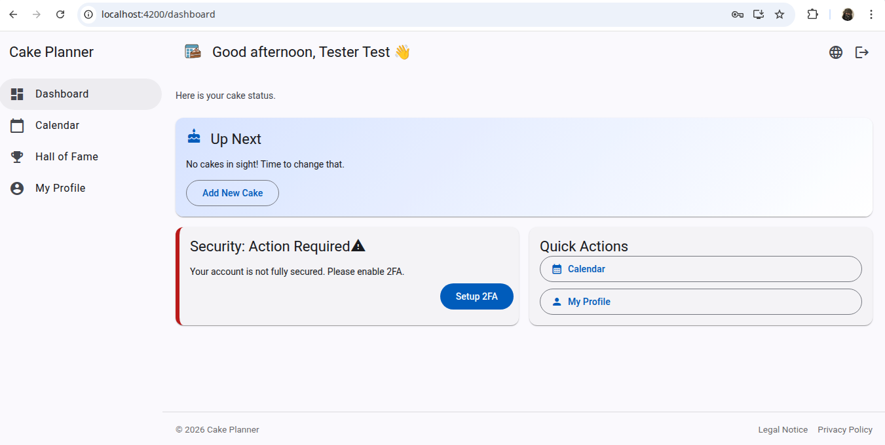
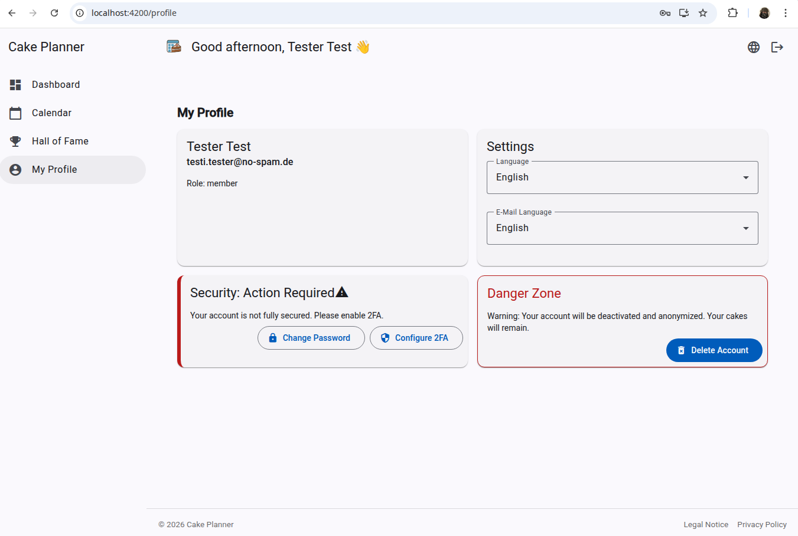
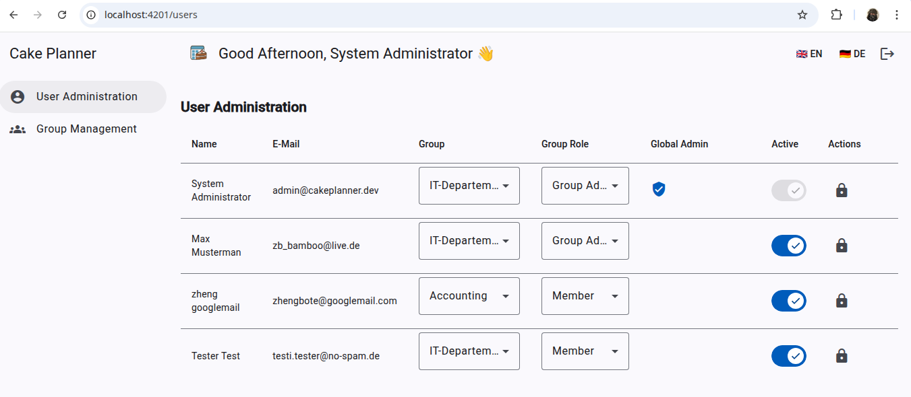

<h1>🍰 CakePlanner</h1>

The sweetest way to organize your cake events.

Gone are the days of chaotic spreadsheets and asking "Who's bringing the cake next Friday?" in the group chat. **CakePlanner** makes organizing baking events, office parties, or club gatherings easy, fun, and visually stunning.

[Report Issue](https://github.com/Zheng-Bote/cake-planner-frontends/issues) · [Request Feature](https://github.com/Zheng-Bote/cake-planner-frontends/pulls)

---

<!-- START doctoc generated TOC please keep comment here to allow auto update -->
<!-- DON'T EDIT THIS SECTION, INSTEAD RE-RUN doctoc TO UPDATE -->
**Table of Contents**

  - [🌟 What is CakePlanner?](#-what-is-cakeplanner)
    - [✨ Key Features](#-key-features)
  - [🚀 How it works](#-how-it-works)
  - [🖼️ Screenshots](#-screenshots)
  - [🛠️ For Administrators (The Technical Stuff)](#-for-administrators-the-technical-stuff)
    - [Admin-Panel](#admin-panel)
      - [Screenshots](#screenshots)
  - [Backend](#backend)
    - [🍰 Overview](#-overview)
    - [🚀 Key Features](#-key-features)
- [See more](#see-more)
- [📄 License](#-license)
  - [🤝 Authors](#-authors)
    - [Code Contributors](#code-contributors)

<!-- END doctoc generated TOC please keep comment here to allow auto update -->

---

## 🌟 What is CakePlanner?

CakePlanner is a simple app that helps groups coordinate who brings what and when. It adds a layer of fun by allowing everyone to rate the creations and share photos of the delicious results.

### ✨ Key Features

- **📅 The Calendar**
  See at a glance who is baking next. Never miss a cake day again! You can even download appointments directly to your personal calendar (ICS).

- **🏆 Hall of Fame**
  Who is the master baker in your group? The Hall of Fame showcases the best-rated cakes.
  - **Voting:** Give 1 to 5 stars for every creation.
  - **Rankings:** See the top-rated cakes sorted by popularity.

- **📸 Photo Galleries**
  - **Baker's Pride:** The event creator can upload a cover photo.
  - **Community Gallery:** Did you take a picture of the cake before it was gone? Upload it! Everyone can contribute photos to an event.
  - **Lightbox View:** Click on any photo to see it in high quality with a beautiful blur effect.

- **📱 Mobile Friendly**
  Whether on your laptop or your smartphone – CakePlanner looks great and works perfectly on the go.

- **🌍 Multi-Language**
  Fully localized for **English** 🇬🇧 and **German** 🇩🇪.

---

## 🚀 How it works

1.  **Dashboard:** Log in and see a friendly greeting and upcoming events.
2.  **Plan:** Click on a date in the calendar to announce your cake. Add a description and a tasty preview photo.
3.  **Eat & Rate:** After the event, log in to rate the cake and upload your own photos ("Food Porn") to the gallery.
4.  **Win:** Check the _Hall of Fame_ to see if your creation made it to the top!

---

## 🖼️ Screenshots

_(some previews from within the dev environment)_

|                            Dashboard                            |                            Calendar                            |
| :-------------------------------------------------------------: | :------------------------------------------------------------: |
|  |  |

|                              Event Detail                              |                             Hall of Fame                              |
| :--------------------------------------------------------------------: | :-------------------------------------------------------------------: |
|  |  |

|                           Profile                           |                         System Info                         |
| :---------------------------------------------------------: | :---------------------------------------------------------: |
|  |  |

---

## 🛠️ For Administrators (The Technical Stuff)

_This section is for the person hosting the app._

CakePlanner is built with performance and modern standards in mind:

- **Frontend:** [Angular 21+](https://angular.io/) (Material Design, Signals, Transloco for i18n).
- **Backend:** Modern **C++23** using the [Crow](https://crowcpp.org/) framework.
- **Database:** SQLite3 (Lightweight and fast).
- **Image Processing:** Qt6-based image optimization (Automatic WebP conversion for fast loading times).

### Admin-Panel

#### Screenshots

|                           user management                            |                           group management                            |
| :------------------------------------------------------------------: | :-------------------------------------------------------------------: |
|  |  |

---

## Backend

A high-performance C++ REST API backend for the Cake Planner application, built with the [Crow](https://crowcpp.org/) microframework and [Qt6](https://www.qt.io/).

### 🍰 Overview

The **Cake Planner Backend** serves as the core infrastructure for coordinating cake-baking events. It manages users, departments (groups), and schedules to ensure there is always cake in the office!

The application is designed to be lightweight yet robust, leveraging C++23 for performance and Qt6 for reliable cross-platform core functionalities.

### 🚀 Key Features

- **High Performance API**: Asynchronous REST API powered by Crow.
- **Security First**:
  - Stateless Authentication using **JWT** (JSON Web Tokens).
  - Secure Password Storage using **Argon2id**.
  - Protection against SQL Injection via **Qt SQL** prepared statements.
- **Structured Data**: Manages Users, Groups, Events, Ratings, and Photo Galleries.
- **Easy Deployment**:
  - Compiles into a single standalone **AppImage**.
  - Docker-ready with **Docker Compose** support.
- **Integrated Services**: SMTP Email Notifications (Welcome, Password Reset) and Internal Health Checks.

# See more

- [CakePlanner Frontend](https://zheng-bote.github.io/cake-planner-frontends/)
- [CakePlanner Backend](https://zheng-bote.github.io/cake-planner-backend/)

---

# 📄 License

This project is licensed under the **MIT License**.

Copyright (c) 2026 ZHENG Robert

## 🤝 Authors

- 

### Code Contributors

---

Made with ❤️ and a lot of sugar. :vulcan_salute:
