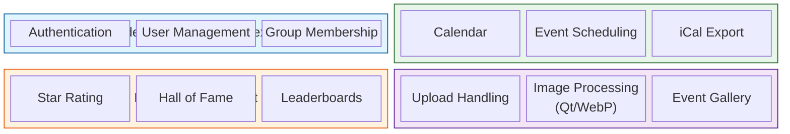
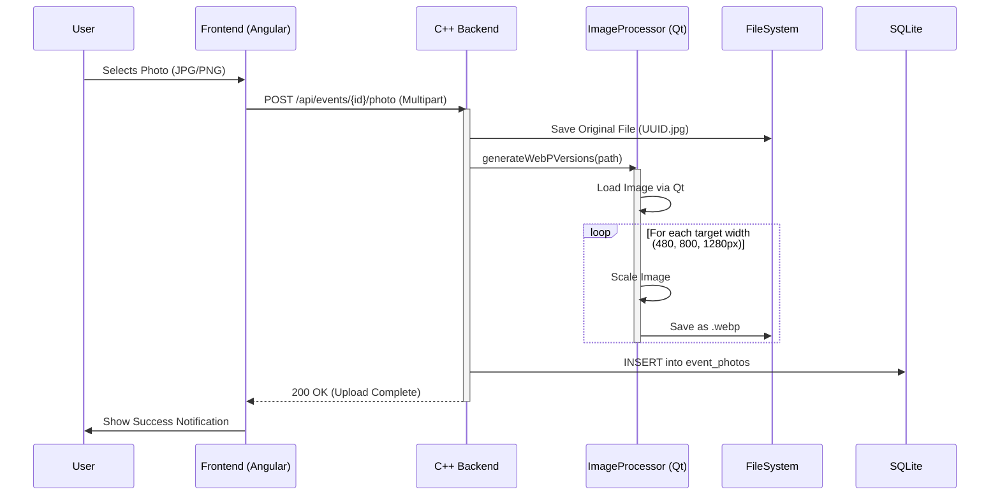

# 🏗️ CakePlanner Architecture

This document provides a high-level overview of the **CakePlanner** architecture, covering the system design, domain boundaries, and key technical workflows.

---

## 1. System Context (The Big Picture)

CakePlanner is designed as a monolithic application that serves baking groups (companies, clubs, friends) to organize events. It acts as the central hub for planning, rating, and sharing photos.

```mermaid
graph LR
    User((User/Baker))

    subgraph "CakePlanner System"
        WebApp[User App(Angular)]
        Backend[Backend API(C++ / Crow)]
        DB[(SQLite DB)]
        FS[File System\n(Uploads)]
    end

    EmailSys[External Email System\n(SMTP)]

    User -->|Uses via Browser| WebApp
    WebApp -->|JSON / HTTP| Backend
    Backend -->|Reads/Writes| DB
    Backend -->|Stores Images| FS
    Backend -.->|Sends Notifications| EmailSys
```

## 2. Container Architecture

The system consists of a modern Single Page Application (SPA) frontend and a high-performance C++ backend.

| Component    | Technology                                                    | Description                                                                     |
| ------------ | ------------------------------------------------------------- | ------------------------------------------------------------------------------- |
| Frontend     | Angular 21+                                                   | Material Design, Signals, Transloco (i18n). Responsive UI for Desktop & Mobile. |
| Backend      | C++23 (Crow)                                                  | REST API, Business Logic, Image Processing.                                     |
| Database     | SQLite3                                                       | Zero-configuration SQL engine. Stores users, events, and ratings.               |
| Media Engine | Qt6,Server-side image processing (scaling & WebP conversion). |

## 3. Domain Design (Bounded Contexts)

To keep the logic organized, the application is conceptually divided into distinct Bounded Contexts. Each context handles a specific part of the business domain.



### 🔎 Context Descriptions

1. Identity & Access: Handles user registration, login, and group assignments. Ensures that only group members can see their events.

2. Planning: The core calendar logic. Manages dates, baker assignments, and prevents scheduling conflicts.

3. Engagement: Contains the logic for the "Hall of Fame". It calculates average ratings and sorts events by popularity.

4. Media: A specialized technical context responsible for handling file uploads, generating thumbnails, and optimizing images for the web (WebP).

## 4. Key Workflows

📸 Image Upload & Optimization Pipeline
One of the key technical features is the automatic optimization of user uploads to ensure fast loading times in the "Hall of Fame".



## 5. Database Schema (Simplified)

The database is normalized to ensure data integrity.

- users: Stores credentials and profile data.
- groups: Manages baking circles.
- group_members: Links users to groups (n:m).
- events: The core entity (Date, Baker, Description).
- ratings: Links users to events with a score (1-5).
- event_photos: Stores paths to community uploads linked to events.

## 6. Directory Structure

```
/
├── public/                 # Static Frontend Files
│   └── uploads/            # User generated content
│       └── {event_id}/     # Isolated folder per event
├── src/
│   ├── controllers/        # API Endpoint definitions
│   ├── models/             # Database entities & Logic
│   ├── services/           # Business logic (e.g. Notifications)
│   └── utils/              # Helpers (ImageProcessor, EnvLoader)
├── include/                # C++ Header files
└── CMakeLists.txt          # Build configuration
```
