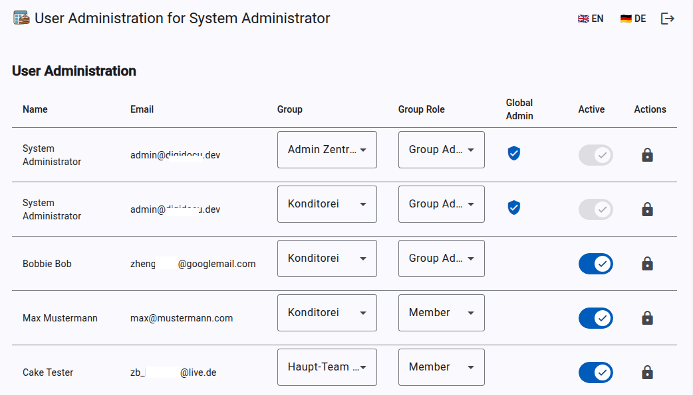

# 🍰 CakePlanner

**The sweetest way to organize your group events.**

Gone are the days of chaotic spreadsheets and asking "Who's bringing the cake next Friday?" in the group chat. **CakePlanner** makes organizing baking events, office parties, or club gatherings easy, fun, and visually stunning.

---

<!-- START doctoc generated TOC please keep comment here to allow auto update -->
<!-- DON'T EDIT THIS SECTION, INSTEAD RE-RUN doctoc TO UPDATE -->

**Table of Contents**

<!-- END doctoc generated TOC please keep comment here to allow auto update -->

---

## 🌟 What is CakePlanner?

CakePlanner is a simple app that helps groups coordinate who brings what and when. It adds a layer of fun by allowing everyone to rate the creations and share photos of the delicious results.

### ✨ Key Features

- **📅 The Calendar**
  See at a glance who is baking next. Never miss a cake day again! You can even download appointments directly to your personal calendar (ICS).

- **🏆 Hall of Fame**
  Who is the master baker in your group? The Hall of Fame showcases the best-rated cakes.

  - **Voting:** Give 1 to 5 stars for every creation.
  - **Rankings:** See the top-rated cakes sorted by popularity.

- **📸 Photo Galleries**

  - **Baker's Pride:** The event creator can upload a cover photo.
  - **Community Gallery:** Did you take a picture of the cake before it was gone? Upload it! Everyone can contribute photos to an event.
  - **Lightbox View:** Click on any photo to see it in high quality with a beautiful blur effect.

- **📱 Mobile Friendly**
  Whether on your laptop or your smartphone – CakePlanner looks great and works perfectly on the go.

- **🌍 Multi-Language**
  Fully localized for **English** 🇬🇧 and **German** 🇩🇪.

---

## 🚀 How it works

1.  **Dashboard:** Log in and see a friendly greeting and upcoming events.
2.  **Plan:** Click on a date in the calendar to announce your cake. Add a description and a tasty preview photo.
3.  **Eat & Rate:** After the event, log in to rate the cake and upload your own photos ("Food Porn") to the gallery.
4.  **Win:** Check the _Hall of Fame_ to see if your creation made it to the top!

---

## 🖼️ Screenshots

_(some previews from within the dev environment)_

|             Dashboard              |             Calendar              |
| :--------------------------------: | :-------------------------------: |
|  |  |

|              Event Detail               |               Hall of Fame               |
| :-------------------------------------: | :--------------------------------------: |
|  |  |

|            Profile             | 2 Factor Authentication |
| :----------------------------: | :---------------------: |
|  |   |

---

## 🛠️ For Administrators (The Technical Stuff)

_This section is for the person hosting the app._

CakePlanner is built with performance and modern standards in mind:

- **Frontend:** [Angular 21+](https://angular.io/) (Material Design, Signals, Transloco for i18n).
- **Backend:** Modern **Qt6 C++23** using the [Crow](https://crowcpp.org/) framework.
- **Database:** SQLite3 (Lightweight and fast).
- **Image Processing:** Qt6-based image optimization (Automatic WebP conversion for fast loading times).

### Admin-Panel

> \[!NOTE]
> The Admin-Panel is currently rudimentary implemented (user management works stable, group-mgmt. still under construction)

#### Screenshots

| user management                       |
| ------------------------------------- |
|  |

### Quick Start

1.  Clone the repository.
2.  Build the C++ Backend (`cmake . && make`).
3.  Build the Angular Frontend (`ng build`).
4.  Run the executable.

---

Made with ❤️ and a lot of sugar.
