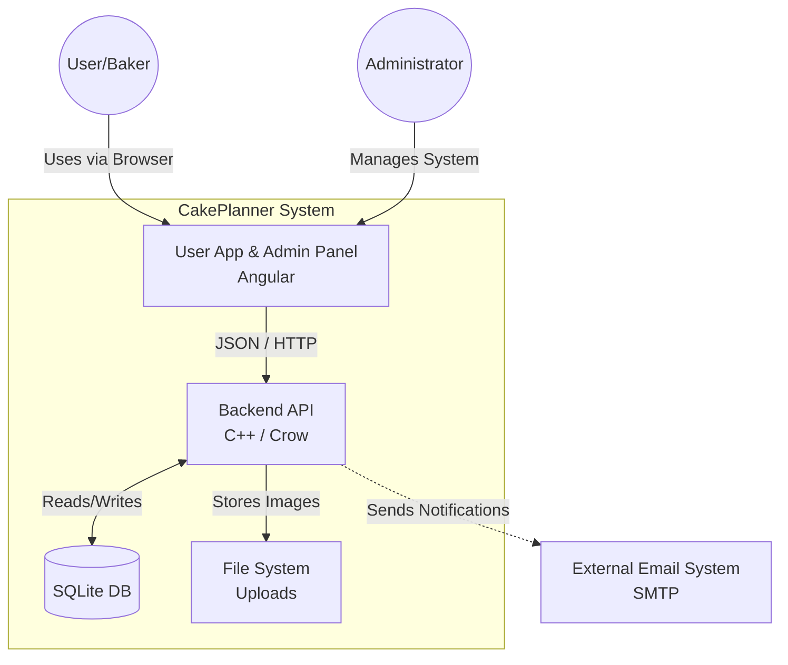
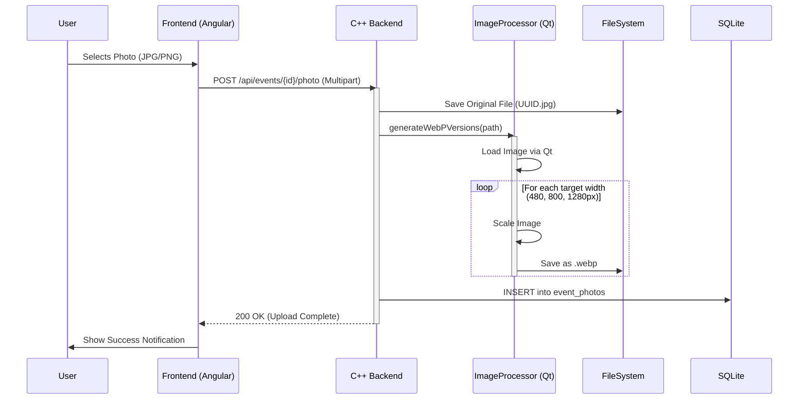

<!-- DOCTOC SKIP -->

# 🏗️ CakePlanner Architecture

This document provides a high-level overview of the **CakePlanner** architecture, covering the system design, domain boundaries, and key technical workflows.

## 1. System Context (The Big Picture)

CakePlanner is designed as a monolithic application that serves baking groups (companies, clubs, friends) to organize events. It acts as the central hub for planning, rating, and sharing photos.



## 2. Container Architecture

The system consists of a modern Single Page Application (SPA) frontend and a high-performance C++ backend.

| Component    | Technology   | Description                                                                     |
| ------------ | ------------ | ------------------------------------------------------------------------------- |
| Frontend     | Angular 21+  | Material Design, Signals, Transloco (i18n). Responsive UI for Desktop & Mobile. |
| Backend      | C++23 (Crow) | REST API, Business Logic, Image Processing.                                     |
| Database     | SQLite3      | Zero-configuration SQL engine. Stores users, events, and ratings.               |
| Media Engine | Qt6          | Server-side image processing (scaling & WebP conversion).                       |

## 3. Domain Design (Bounded Contexts)

To keep the logic organized, the application is conceptually divided into distinct Bounded Contexts. Each context handles a specific part of the business domain.

```mermaid
graph TB
    subgraph Identity ["Identity & Access Context"]
        direction TB
        style Identity fill:#e1f5fe,stroke:#01579b
        Auth[Authentication]
        Users[User Management]
        Groups[Group Membership]
    end

    subgraph Planning ["Planning Context"]
        direction TB
        style Planning fill:#e8f5e9,stroke:#1b5e20
        Calendar[Calendar]
        Events[Event Scheduling]
        ICS[iCal Export]
    end

    subgraph Engagement ["Engagement Context"]
        direction TB
        style Engagement fill:#fff3e0,stroke:#e65100
        Voting[Star Rating]
        Reviews[Hall of Fame]
        Ranking[Leaderboards]
    end

    subgraph Media ["Media Context"]
        direction TB
        style Media fill:#f3e5f5,stroke:#4a148c
        Upload[Upload Handling]
        Process[Image Processing<br/>Qt/WebP]
        Gallery[Event Gallery]
    end

    subgraph Admin ["Administration Context"]
        direction TB
        style Admin fill:#eceff1,stroke:#455a64
        UserMod[User Moderation]
        SysConfig[System Settings]
        Logs[Audit Logs]
    end
```



### 🔎 Context Descriptions

1. **Identity & Access**: Handles user registration, login, and group assignments. Ensures that only group members can see their events.

2. **Planning**: The core calendar logic. Manages dates, baker assignments, and prevents scheduling conflicts.

3. **Engagement**: Contains the logic for the "Hall of Fame". It calculates average ratings and sorts events by popularity.

4. **Media**: A specialized technical context responsible for handling file uploads, generating thumbnails, and optimizing images for the web (WebP).

5. **Administration**: Provides tools for system maintainers to manage users, reset passwords, configure global settings, and view system logs.

## 4. Key Workflows

📸 Image Upload & Optimization Pipeline
One of the key technical features is the automatic optimization of user uploads to ensure fast loading times in the "Hall of Fame".



## 5. Database Schema (Simplified)

The database is normalized to ensure data integrity.

- users: Stores credentials and profile data.
- groups: Manages baking circles.
- group_members: Links users to groups (n:m).
- events: The core entity (Date, Baker, Description).
- ratings: Links users to events with a score (1-5).
- event_photos: Stores paths to community uploads linked to events.

## 6. Directory Structure

```
/
├── public/                 # Static Frontend Files
│   └── uploads/            # User generated content
│       └── {event_id}/     # Isolated folder per event
├── src/
│   ├── controllers/        # API Endpoint definitions
│   ├── models/             # Database entities & Logic
│   ├── services/           # Business logic (e.g. Notifications)
│   └── utils/              # Helpers (ImageProcessor, EnvLoader)
├── include/                # C++ Header files
└── CMakeLists.txt          # Build configuration
```
